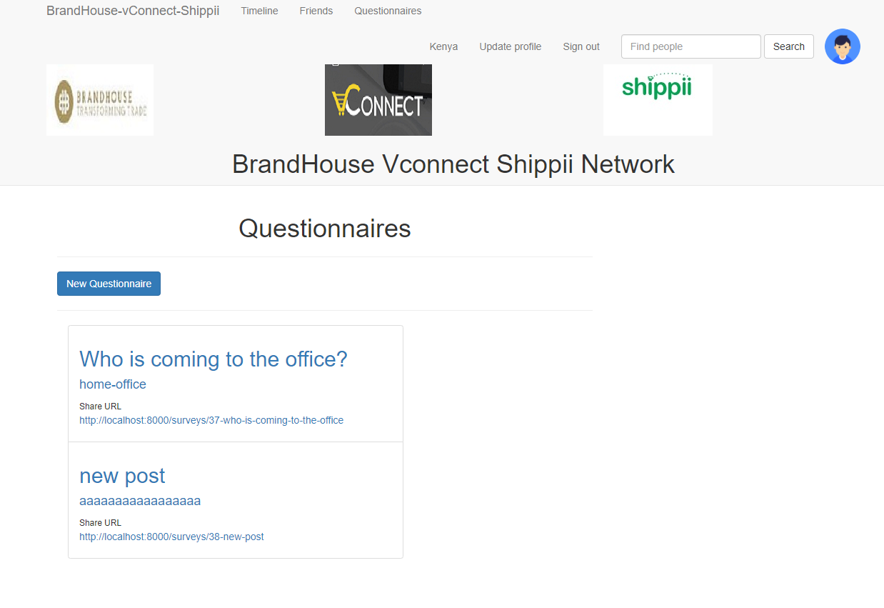

## About BrandHouse vConnect Shippii Net

It is a Laravel based project to connect the employee from the three companies.

How to run it?
1. git clone: git@github.com:sashokrist/BrandHouse-vConnect-Shippii-net.git
2. composer install
3. cp .env.example .env
4. php artisan key:generate

Set database credentials

5. php artisan migrate

Open project on localhost:8000

   
   
  

